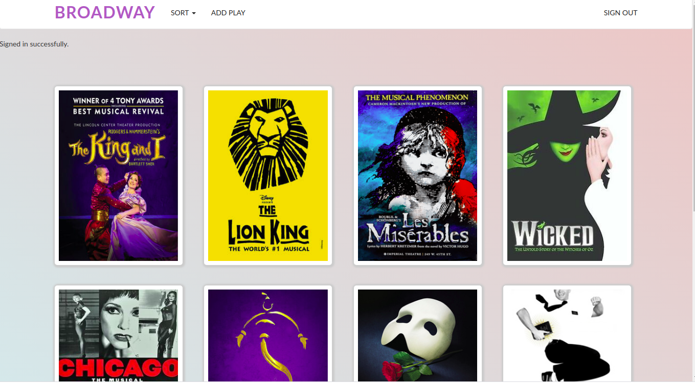

# Broadway App

An app where users can add, update, update and destroy plays.
Users can also add, edit and destroy reviews.
Each play can be rated using a star system and each play will also have average rating calculated and shown.
Using the Devise gem, users can sign-up or if they are already signed-up they can sign-in.
For editing or deleting plays and reviews a user must sign-in.

## Screenshot



## Contribution guide

1. Clone the project
```bash
  git clone https://github.com/Mesi21/Broadway_app.git
  cd Broadway_app
  install the gems by running: `$ bundle install`
  update the bundle: `$ bundle update`
  start the server `$ rails s`
  open browser: `localhost:3000`
```

2. Then :heavy_plus_sign: add your contribution
3. And Feel free to make a PR

## Tehnical tools:

- Rails
- Ruby

* System dependencies:
- gems: 
    - simple_form
    - bootstrap-sass

## Contributors

- Emese Molnar [@Mesi21](https://github.com/Mesi21)

## Course Project

- This is a project of a [Udemy](https://www.udemy.com/) course about Ruby on Rails, built based on the explanations of the author of the course. 

### If you like this project don't forgot to support it by giving a :star: 
